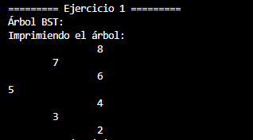
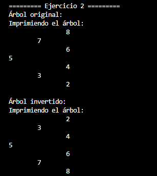
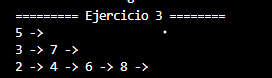

# Práctica 4 - Ejercicios de Árboles

## Estudiante

Valeria Araceli Jimenez Placencia

## Asignatura

Estructura de Datos – Grupo -6- Computacion

## Descripción

En esta práctica se desarrollaron ejercicios relacionados con árboles binarios y árboles binarios de búsqueda (BST). Se implementaron algoritmos para insertar nodos, invertir un árbol, listar los niveles y calcular la profundidad máxima.

---

## Ejercicio 1: Insertar en un BST

### Método

`insert(int[] numeros)`

### Explicación

Se creó un árbol binario de búsqueda e insertaron los elementos de un arreglo de enteros. Cada valor se ubicó siguiendo la regla de los BST: los valores menores se colocan a la izquierda y los mayores a la derecha.

### Resultado

Con los valores:

```text
[5, 3, 7, 2, 4, 6, 8]
```

se generó correctamente el árbol binario de búsqueda.
adjunto captura de la salida :



---

## Ejercicio 2: Invertir un Árbol Binario

### Método

`invert(Node<Integer> root)`

### Explicación

Se utilizó recursividad para intercambiar el hijo izquierdo y el hijo derecho de cada nodo del árbol. El proceso se repite hasta recorrer todos los nodos.

### Resultado

Se obtuvo una versión invertida del árbol original.
adjunto captura de la salida :



---

## Ejercicio 3: Listar Niveles

### Método

`listLevels(Node root)`

### Explicación

Se realizó un recorrido por niveles utilizando una cola. Los nodos de cada nivel se almacenaron en una lista independiente.

### Resultado

Ejemplo de salida:

```text
5
3 -> 7
2 -> 4 -> 6 -> 8
```
salida en consola :



---

## Ejercicio 4: Profundidad Máxima

### Método

`maxDepth(Node root)`

### Explicación

Se utilizó recursividad para calcular la profundidad de los subárboles izquierdo y derecho. Se tomó la mayor profundidad encontrada y se sumó uno para incluir el nodo actual.

### Resultado

El método devuelve el número máximo de niveles del árbol.
adjunto captura de la salida en consola:


---

# Conclusiones

* Se aplicaron estructuras de datos no lineales.
* Se reforzó el uso de recursividad en árboles binarios.
* Se implementaron algoritmos de recorrido y transformación de árboles.
* Se comprendió el cálculo de profundidad y el recorrido por niveles.

# Repositorio

[(https://github.com/jimenezvaleria397-spec/icc-est-u2-EstructurasNoLineales.git)]
