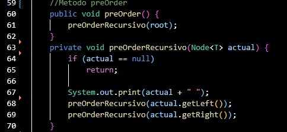
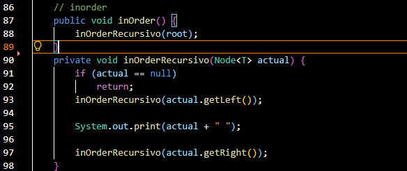
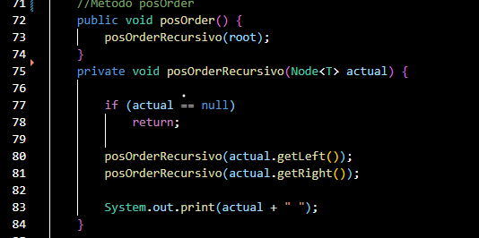
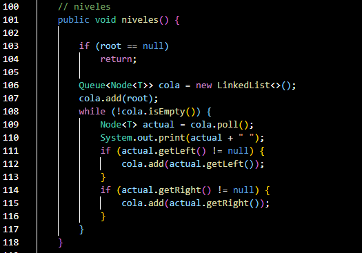
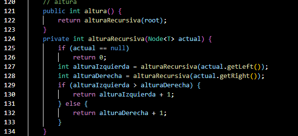
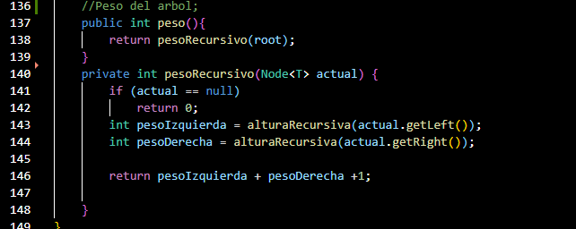
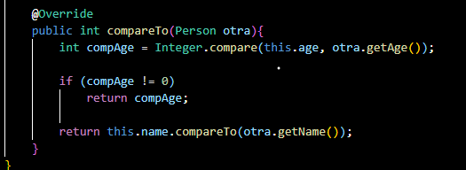

# Práctica: [Estructuras no linesles]

## Datos del Estudiante
- **Nombre:** [Valeria Araceli Jimenez Placencia]
- **Curso:** [Grupo - 6 - Computación ]
- **Fecha:** [17/06/2026]

---

## 1. [Estructuras No Lineales: Pre-Order, In-Order, Pos-Order y Cálculo Altura del árbol]
[Creamos un metodo de recorrido de arboles binarios, que ordenaran en inOrder, posOrder, preOrder, adicionamos tambien un metodo que calcula la altura de el arbol]

**Captura de codigo Pre-Order:**

**Captura de codigo In-Order:**

**Captura de codigo Pos-Order:**

**Captura de codigo por Niveles :**

**Captura de codigo por Altura :**

---

## 2. Calculo Peso De Arbol

**Fecha:** [17/06/2026]
**Descripción:** Calculamos el peso de un Arbol Binario con la clase BinaryTree creada en la carpeta Tree, ademas crramos una carpeta models con la clase Person incluida dentro de ella, ademas de un metoso runPersonTree() en el APP.

---
**Captura de codigo Peso del Arbol :**

**Captura de codigo con el metodo compareTo() :**

